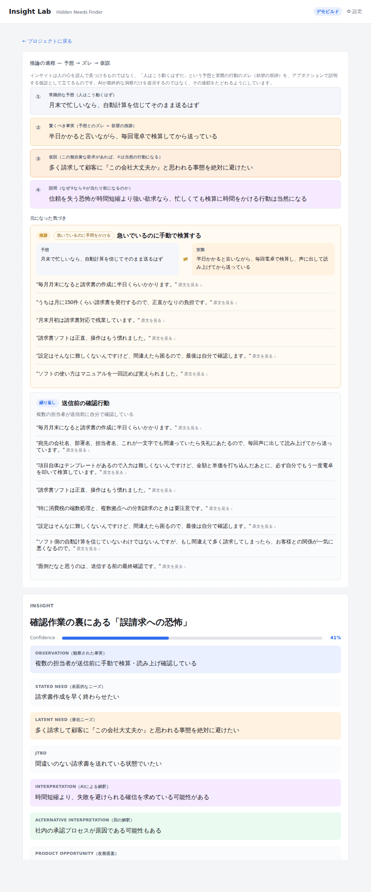
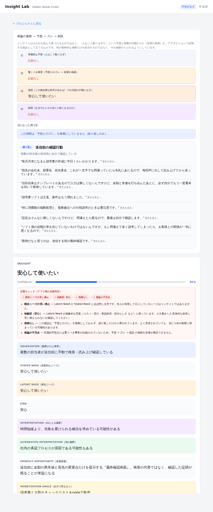
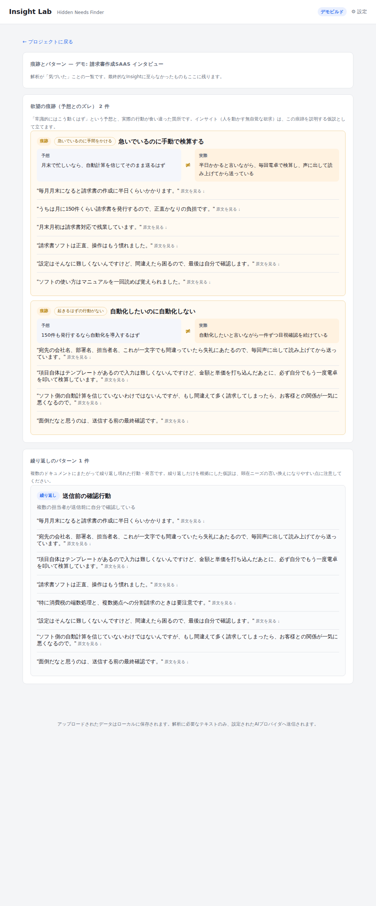
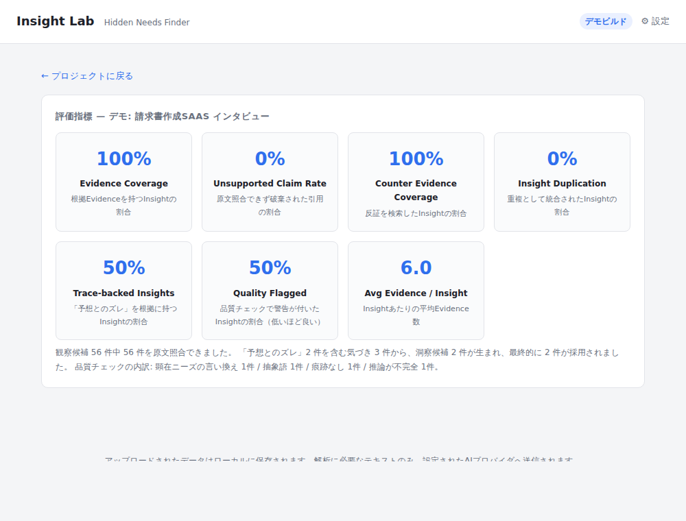
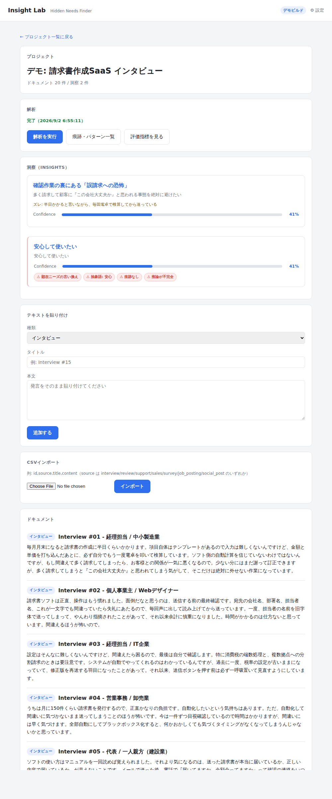

# Insight Lab – Hidden Needs Finder

[](LICENSE)
[](go.mod)

顧客インタビュー・レビュー・問い合わせ履歴などのテキストから、明示されていない潜在ニーズ・JTBD・改善仮説を抽出するローカル実行型 AI 分析ツール。Go 単一バイナリ + 埋め込み Web UI + SQLite + OpenAI 互換 LLM API。

Insight は単独で提示せず、必ず **Insight → Evidence（原文照合済み引用）→ 反証 → Confidence** のセットで表示する。「複数の声を突き合わせて『ここが違う』と気づく」というインサイト抽出特有のブラックボックスな推論過程も、Observation（引用）→ Pattern（繰り返しへの気づき）→ Rationale（なぜその仮説に至ったか）→ Insight という連鎖として、Insight詳細画面と `#/projects/:id/patterns` ページでたどれるようにしている。

### インサイトの見つけ方をそのまま実装する

インサイトとは「人を動かす無自覚な欲求」であり、「コスパ」「安心」のような顕在ニーズや、「承認欲求」「自分らしさ」のような抽象語はインサイトではない。欲求そのものは見えないが、欲求が残した痕跡（急いでいるのに時間をかける、予定より多く払う、不満なのに使い続ける、起きるはずの行動が起きない）は見える。Insight Lab はこの作法を LLM への指示ではなく、パイプラインの構造とアプリ側の検証として組み込んでいる（[docs/detailed-design.md §23](docs/detailed-design.md)）。

1. **予想する** — 常識に照らして「この人はこう動くはずだ」という予想を立てる
2. **ズレを痕跡として捉える** — 予想と実際の行動の食い違いを `Trace`（`kind = deviation` の Pattern）として検出・保存し、「予想 ≠ 実際」を並べて表示する
3. **アブダクションで仮説を立てる** — 「驚くべき事実 C が観察された。仮説 H が真なら C は当然になる。よって H」という形式で潜在ニーズを生成し、①予想 → ②ズレ → ③仮説 → ④説明 の連鎖を Insight 詳細画面に表示する
4. **アプリ側で粗悪品を判定する** — 生成された Latent Need が「顕在ニーズの言い換え」「抽象語」「痕跡なし（繰り返しのみ）」「推論が不完全」のいずれかに当たる場合、モデルの自己評価ではなく決定的なチェック（`internal/service/quality.go`）で警告を付ける。却下はせず、最終判断はリサーチャーに委ねる。評価画面では「痕跡を根拠に持つ Insight の割合」「警告付き Insight の割合」を確認できる

抽出エンジンはドメイン非依存。顧客インタビューだけでなく、案件サイトの募集文や伸びているSNS投稿を貼り付けても同じロジックで「隠れたニーズ」を見つけられる。各Insightには `Product Opportunity`（対象企業向けの改善提案）に加えて **`Monetization Angle`**（そのニーズを自分自身が商品・サービス化するなら何ができるか）も出力される。他社に売り込むデモにも、自分で機会を見つけて自分で作る用途にも使える。

## 想定する使い道

Insight Lab は、単なるAI要約ツールではなく、顧客理解を改善施策や次の商談へつなげるための**根拠付き診断ツール**として設計している。

| 対象 | 入力 | 得られる成果 |
|---|---|---|
| SaaS のPM・CS責任者 | 問い合わせ、解約理由、商談ログ | 解約・定着を左右する潜在ニーズと改善仮説 |
| 制作・コンサル会社 | 顧客インタビュー、アンケート | 原文根拠と反証を伴う提案材料 |
| 新規事業担当 | レビュー、案件募集文、SNS投稿 | 支払い意思の兆候と商品化の切り口 |

典型的な提供フローは「少量データでデモ → 20〜100件のスポット診断 → Markdownレポートと読み解き会 → 月次の継続診断」。詳細は[事業活用方針](docs/business-strategy.md)を参照。

## スクリーンショット

同梱デモデータ（架空の請求書SaaSインタビュー20件）を解析したときの表示例。

| | |
|---|---|
| **Insight 詳細 — 推論の過程** ①常識的予想 → ②予想とのズレ（欲望の痕跡）→ ③仮説 → ④説明 の連鎖と、元になった痕跡・繰り返しパターン。引用をクリックすると原文の該当箇所がハイライトされる | **品質チェック付きの Insight** 「顕在ニーズの言い換え」「抽象語」「痕跡なし」「推論が不完全」の警告がアプリ側の判定で付く。却下はせず、リサーチャーが最終判断する |
|  |  |
| **痕跡とパターン一覧** 「予想 ≠ 実際」を並べて表示する欲望の痕跡と、複数人にまたがる繰り返し。Insight に至らなかった気づきもここに残る | **評価指標** Evidence Coverage / Unsupported Claim Rate / Trace-backed Insights / Quality Flagged など。モデルやプロンプトを変えたときの劣化を監視する |
|  |  |

<details>
<summary>プロジェクト画面（ドキュメント一覧・解析実行・Insight 一覧）</summary>



</details>

## Confidence と Quality Flags

Insight には 2 つの独立した評価軸が付く。どちらも **LLM に自己申告させず、アプリ側で計算・判定する**。

### Confidence（どれだけ支持されているか）

```
Confidence = EvidenceStrength × 0.35   // 支持 Evidence の relevance 平均（LLM が並べた順位から機械的に算出）
           + EvidenceCoverage × 0.25   // 支持 Evidence を持つ Document 数 / プロジェクト内 Document 数
           + SourceDiversity  × 0.20   // 支持 Evidence の SourceType 種類数 / 5（上限 1.0）
           + PatternFrequency × 0.20   // パターンが現れた Document 数 / 5（上限 1.0）

反証 Evidence があれば × (1 − 0.1 × min(反証件数, 3)) で減衰
```

Evidence はすべて Grounding Check を通過した引用（原文照合済み）から構築されるため、Confidence の入力に LLM が生成した文章や数値は含まれない。重みは初期値で、`internal/service/confidence.go` で変更できる。

### Quality Flags（そもそもインサイトか）

| フラグ | 判定 |
|---|---|
| 顕在ニーズの言い換え `stated_need_echo` | Latent Need と Stated Need を正規化（空白・句読点除去、全半角統一）し、包含関係または文字 bigram の Jaccard 係数 ≥ 0.5 |
| 抽象語 `generic_term` | Latent Need に「コスパ / 安心 / 便利 / 効率 / 承認欲求 / 自分らしさ / 自己実現 …」等の語を含む |
| 痕跡なし `no_trace` | 仮説が引用した Pattern に「予想とのズレ」が 1 つもない（繰り返しのみから導かれた） |
| 推論が不完全 `abduction_incomplete` | 常識的予想または驚くべき事実が空で、予想 → ズレ → 仮説 の連鎖を検証できない |

Confidence は「Evidence にどれだけ支持されているか」、Quality Flags は「インサイトの定義（人を動かす無自覚な欲求）を満たしているか」を表す。繰り返しに強く支持された顕在ニーズの言い換えは、**Confidence が高く、かつ警告付き**という形で現れる。評価画面の Trace-backed Insights / Quality Flagged で、プロジェクト全体の傾向を確認できる。詳細は [docs/detailed-design.md](docs/detailed-design.md) §7 / §23。

## 動作要件

- Go 1.25 以上（ソースからビルドする場合。`go.mod` 参照）
- CGO 不要（`modernc.org/sqlite` を使用したピュア Go 実装のため、クロスコンパイルも `CGO_ENABLED=0` で完結）
- OpenAI 互換の LLM API（Base URL / Model / API Key）— 解析実行時に必要。DB や CSV の閲覧・インポートだけならキー未設定でも起動可能

## クイックスタート

```bash
# デモ用ビルド（架空の請求書SaaSインタビュー20件を同梱）
make build-demo
./bin/insight-lab-demo --demo

# 納品用ビルド（デモデータはバイナリに一切含まれない）
make build-delivery
./bin/insight-lab --client "顧客企業名"
```

起動すると `http://127.0.0.1:8787` でブラウザが自動で開く。ブラウザの「⚙ 設定」から OpenAI 互換の Base URL / Model / API Key を設定すると（`--api-key` `--model` `--base-url` フラグでも可）、プロジェクト画面の「解析を実行」で Hidden Needs 抽出が動く。

## 使い方（ローカルで一通り試す）

```bash
make build-demo
./bin/insight-lab-demo --demo --base-url https://api.openai.com/v1 --model gpt-5 --api-key sk-...
```

1. ブラウザで「デモを試す」→ 請求書SaaSインタビュー20件のプロジェクトが開く
2. 「解析を実行」→ SSEで進捗が流れ、Hidden Need が Evidence・反証・Confidence 付きで表示される
3. Insight詳細の「推論の過程」で、①常識的予想 → ②予想とのズレ（欲望の痕跡）→ ③仮説 → ④説明 の連鎖と、元になった痕跡・繰り返しパターンを確認できる。品質チェックの警告（顕在ニーズの言い換え・抽象語・痕跡なし）が付いた Insight は一覧・詳細でマークされる。Evidence をクリックすると、元ドキュメントの該当箇所がハイライトされる（grounding 検証済みの引用のみを表示）
4. 「痕跡・パターン一覧」「評価指標を見る」で、最終的な Insight に至らなかった痕跡・Pattern や、Evidence Coverage / Unsupported Claim Rate / Trace-backed Insight Rate / Quality Flagged Rate などを確認できる
5. 「レポートを保存」から、推論過程、改善案、品質警告、支持・反証EvidenceをまとめたMarkdownをダウンロードする
6. CSVインポート（`id,source,title,content` 固定列）や設定画面からの接続テストも利用可能

### レポートのエクスポート

プロジェクト画面の「レポートを保存」を押すか、次のAPIから最新結果を取得できる。

```bash
curl -o insight-report.md http://127.0.0.1:8787/api/projects/<projectID>/report.md
```

レポートには品質指標、各Insightの潜在ニーズ・Confidence・推論過程・Product Opportunity・Monetization Angle・品質警告・原文照合済みEvidenceが含まれる。AIによる仮説をそのまま最終判断に使わず、レポート内の引用を確認してから意思決定すること。

## デモビルドと納品ビルドの分離

顧客への納品物にサンプルデータ（自社の営業用テキスト）が混入しないよう、ビルド時点で分離している。

| コマンド | 用途 | デモデータ |
|---|---|---|
| `make build-demo` | 商談・営業デモ | 埋め込み済み。`--demo` で自動ロード、UIの「デモを試す」でも可 |
| `make build-delivery`（デフォルト） | 顧客納品 | **コンパイル時にバイナリへ一切リンクされない**（`internal/sampledata` の Go build tag で分岐） |

納品ビルドで `--demo` を指定するとエラーで起動を拒否する。`make cross-compile` で両ビルド × 4 プラットフォーム（macOS arm64/amd64, Linux amd64, Windows amd64）を一括生成できる。

## 開発

```bash
make vet    # go vet（デモ/納品タグ両方）
make test   # go test（デモ/納品タグ両方）
```

### 実LLMでの評価

単体テストとE2Eはフェイク LLM で決定的に回しているが、プロンプトやモデルを変えたときの出力品質は実 LLM でしか測れない。次のコマンドでデモデータ20件を実 LLM で解析し、評価指標・全 Insight（予想 → ズレ → 仮説 → 説明、品質フラグ、Evidence）・全痕跡/パターンを `docs/evaluation/<日付>-<モデル>/` に JSON と Markdown で保存する。

```bash
INSIGHT_LAB_API_KEY=sk-... INSIGHT_LAB_MODEL=gpt-5 make eval-demo
# OpenAI 以外: INSIGHT_LAB_BASE_URL=https://openrouter.ai/api/v1 など
```

API キーはバイナリの引数にしか渡さず、出力ディレクトリには書かれない。結果は [docs/evaluation/](docs/evaluation/) に蓄積し、Trace-backed Insights / Quality Flagged の推移でモデル・プロンプト変更の劣化を検出する。

## ドキュメント

| ドキュメント | 内容 |
|---|---|
| [docs/detailed-design.md](docs/detailed-design.md) | 確定版詳細設計 v1（アーキテクチャ / ドメインモデル / パイプライン / DDL / API / ビルド分離） |
| [docs/design-review.md](docs/design-review.md) | ドラフト設計の検証レポート（P0/P1/P2 の指摘と修正方針） |
| [docs/implementation-plan.md](docs/implementation-plan.md) | フェーズ別実装プラン（Phase 1〜6、完了条件、リスク） |
| [docs/business-strategy.md](docs/business-strategy.md) | 事業上の位置づけ、初期顧客、提供モデル、開発優先順位 |

## ステータス

Phase 1〜3 実装完了（単一バイナリ骨格、デモ/納品ビルド分離、LLM接続、Observation抽出、Grounding Check、Hidden Needs パイプライン、Evidence/Confidence、SSE進捗、評価画面、CSVインポート、Markdownレポート、GitHub Actions CI/Release）。Phase 6 のうち Trace Detection（予想とのズレの検出）・アブダクション形式の仮説・Quality Gate を実装済み。詳細は [docs/implementation-plan.md](docs/implementation-plan.md) を参照。

## コントリビュート

Issue / Pull Request を歓迎します。開発環境のセットアップやコミット規約は [CONTRIBUTING.md](CONTRIBUTING.md) を、参加にあたっての行動規範は [CODE_OF_CONDUCT.md](CODE_OF_CONDUCT.md) を参照してください。

脆弱性を発見した場合は、公開 Issue ではなく [SECURITY.md](SECURITY.md) の手順に従って報告してください。

## ライセンス

[Apache License 2.0](LICENSE) の下で公開しています。商用利用・改変・再配布・非公開フォークいずれも自由に行えます（詳細はライセンス本文を参照）。
