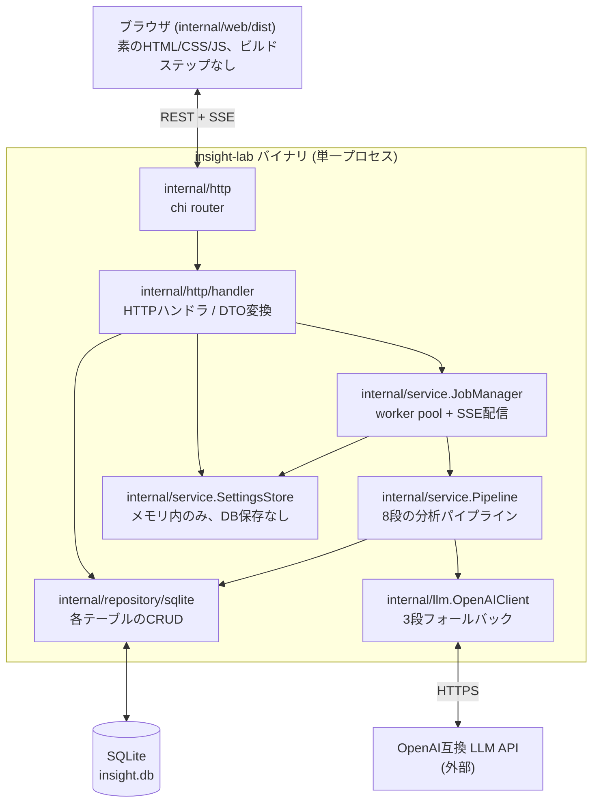
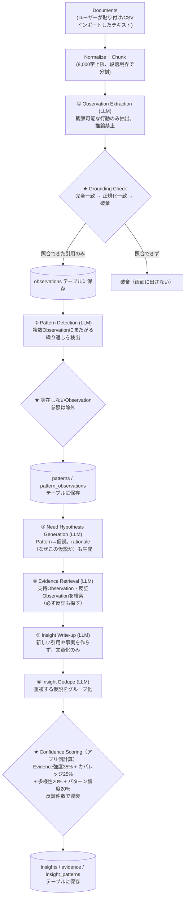
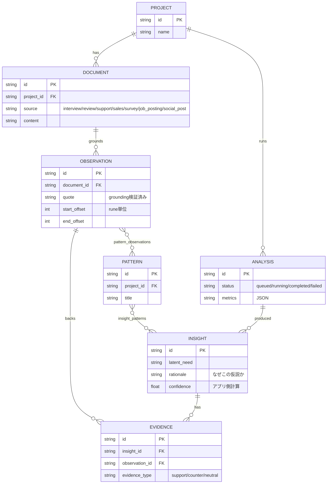

# アーキテクチャガイド

このドキュメントは、このコードベースを初めて触るエンジニア向けの「地図」です。プロダクトとしての背景は [blueprint.md](./blueprint.md)、確定した設計判断とその理由は [detailed-design.md](./detailed-design.md)（実装ログに近い、変更履歴つきの詳細版）を参照してください。本書はその2つより「今すぐコードを触るために必要な情報」に絞っています。

---

## 1. システム全体図

外部通信は LLM API 呼び出しのみ。ブラウザはこのプロセスにしか接続しない（`127.0.0.1` バインド + Origin検証）。

## 2. ディレクトリ構成

| パス | 役割 |
|---|---|
| `cmd/insight-lab/main.go` | エントリポイント。フラグをパースして `internal/app.Run` を呼ぶだけ |
| `internal/app/` | 起動時の配線（DB接続・全リポジトリ生成・JobManager起動・HTTPサーバ起動） |
| `internal/domain/` | ドメインモデル（`Project`, `Document`, `Observation`, `Pattern`, `Insight`, `Evidence`, `Analysis`）。DB非依存の純粋な構造体 |
| `internal/repository/` | リポジトリのインターフェース定義（DB実装への依存を切る層） |
| `internal/repository/sqlite/` | SQLite実装。マイグレーション（`migrations/001_init.sql`）もここ |
| `internal/llm/` | LLM抽象化。`client.go`がインターフェース、`openai.go`が実装（3段フォールバック） |
| `internal/service/` | ビジネスロジックの本体。**このプロジェクトの核** |
| `internal/http/` | ルーティング（`router.go`）+ ハンドラ（`handler/`）+ ミドルウェア |
| `internal/web/` | フロントエンド埋め込み（`embed.go` + `dist/`配下の素のHTML/CSS/JS） |
| `internal/sampledata/` | デモ用データ。`//go:build demo`タグで納品ビルドから完全に除外される仕組み（§7参照） |
| `docs/` | 本ドキュメント群 |

### `internal/service/` の内訳（重要なので個別に）

| ファイル | 役割 |
|---|---|
| `pipeline.go` | 分析パイプライン本体。`Pipeline.Run()` が全ステップをオーケストレーションする |
| `pipeline_types.go` | 各LLMステップの入出力型・JSON Schema・バリデーション |
| `prompts.go` | 各ステップのシステムプロンプト |
| `grounding.go` | **最重要ファイル。** LLMが返した引用を原文照合する。詳細は§6 |
| `confidence.go` | Confidenceスコアの計算式（LLMには一切計算させない） |
| `textproc.go` | Normalize + Chunk（8,000字上限での分割） |
| `jobmanager.go` | 非同期実行のworker pool + SSE配信 |
| `settings.go` | LLM接続設定（メモリ内のみ、永続化しない） |
| `csv_import.go` | CSVインポート |
| `demo.go` | デモプロジェクトの冪等ロード |
| `llm_probe.go` | 設定画面の接続テスト |

## 3. 分析パイプライン全体図（このプロダクトの核）

`Pipeline.Run()`（`internal/service/pipeline.go`）が実行する8段階。★は「AIの出力をそのまま信じない」ための構造的な検証ポイント。

**重要な設計判断**: Evidence（Insightの根拠）は、LLMに「Evidence IDを参照させる」方式ではなく、**Evidence Retrievalが選んだ既にgrounding済みのObservationから直接構築する**。これにより「存在しないEvidenceをLLMが捏造する」という失敗モード自体が構造的に発生しない。詳細は [detailed-design.md §20](./detailed-design.md) 参照。

## 4. データモデル

実際のDDLは `internal/repository/sqlite/migrations/001_init.sql` を正とする（上図は関係の概観のみ）。

## 5. リクエストライフサイクル: 解析の実行

1. ブラウザが `POST /api/projects/{id}/analysis` を叩く
2. `handler.CreateAnalysis` → `JobManager.Enqueue` が `analyses` 行を `status=queued` で作成し、内部キューに積む
3. worker goroutine（デフォルト2並列、`internal/app/app.go` の `analysisWorkers`）がキューから取り出し、その時点の `SettingsStore` からLLMクライアントを構築して `Pipeline.Run` を呼ぶ
4. パイプラインは各ステップで `ProgressFunc` を呼ぶ → `JobManager` が `analyses` 行を更新 + SSE購読者へ配信
5. ブラウザは `GET /api/analysis/{id}/events`（SSE）で進捗を受信。再接続時は `GET /api/analysis/{id}` でスナップショットを取得できる
6. 完了時、`analyses.metrics` に評価指標（`service.Metrics`）をJSONで保存

**プロセス強制終了への耐性**: 起動時（`internal/app/app.go`）に `AnalysisRepository.FailInterrupted` を呼び、`queued`/`running`のまま残っている解析を `failed` に倒す。

## 6. Grounding — 変更前に必ず理解すること

`internal/service/grounding.go` の `Ground(content, quote string) (Grounded, bool)` が全ての引用の生殺与奪を握る。

- まず完全一致（rune単位の部分文字列検索）
- 失敗したら正規化一致（空白・句読点・全角半角ASCIIを正規化して比較し、一致したオフセットを元の文字列に逆写像）
- それでも失敗したら **破棄**。呼び出し側（`pipeline.go` の `extractAndGroundAll`）はその候補を`Observation`にせず、`Metrics.UnsupportedClaimRate`としてカウントするのみ

オフセットは **rune単位**（バイト単位でもUTF-16単位でもない）。日本語テキストで文字化けせずスライスできる。フロントエンド（`app.js`）は `content.slice(start, end)` で同じ結果になる前提（BMP内の文字のみを想定）。

**このファイルを変更する時の鉄則**: 「LLMの引用を信じて表示する」経路を絶対に作らない。新しいステップを追加するときも、ユーザーに見せる引用は必ず `Ground()` を通す。

## 7. デモ/納品ビルドの分離

`internal/sampledata/` が2つのファイルに分かれている。

- `embed_demo.go`（`//go:build demo`）: `testdata/interviews.json` を `//go:embed` する
- `embed_delivery.go`（`//go:build !demo`）: 何も埋め込まない

`make build-demo` は `-tags demo` を付けてビルドし、`make build-delivery`（デフォルト）は付けない。**ランタイムのif分岐ではなくコンパイル時の分離**なので、納品ビルドのバイナリにサンプルテキストが物理的にリンクされない（`grep`で確認可能。CIでも毎回検証している）。

新しいデモ専用データ・機能を追加する場合は、必ずこの分離パターンを踏襲すること。

## 8. 「〜したいときはここを見る」チートシート

| やりたいこと | 触るファイル |
|---|---|
| 新しいLLMプロバイダ（Azure/Ollama等）を試す | 何もコード変更不要。設定画面かフラグで Base URL/Model/API Key を変えるだけ（`internal/llm.NewOpenAIClient` はOpenAI互換ならどこでも動く） |
| 新しいパイプラインステップを追加する | `pipeline_types.go`にスキーマ追加 → `prompts.go`にプロンプト追加 → `pipeline.go`の`Run()`に呼び出しを追加。**ユーザーに見せる引用を新たに扱うなら必ず`Ground()`を通す** |
| 新しいDocument種別（source type）を追加する | `internal/domain/document.go`の`SourceType`定数と`Valid()` → `migrations/001_init.sql`のCHECK制約 → `app.js`の`SOURCE_LABELS`とセレクトボックス |
| Confidence計算式を調整する | `internal/service/confidence.go`。変更したら`confidence_test.go`も更新し、Golden Dataset（未作成、§blueprint参照）での回帰確認を検討 |
| 新しいDBテーブル・カラムを追加する | v1.0未タグ付けの間は `migrations/001_init.sql` を直接編集してよい。**タグ付け("released")後は絶対に直接編集せず、`002_*.sql`のような新規マイグレーションファイルを追加すること**（`internal/repository/sqlite/sqlite.go`のmigrateはファイル名の連番で適用済みを判定する） |
| 新しいHTTPエンドポイントを追加する | `internal/http/handler/`に処理を書く → `internal/http/router.go`にルート登録 → 必要なら`internal/http/handler/handler.go`の`Handler`構造体にリポジトリを追加 → `internal/app/app.go`と`internal/http/router.go`の`Deps`に配線 |
| フロントエンドに新しい画面を追加する | `internal/web/dist/app.js`に`render〜`関数を追加し、`route()`の正規表現マッチに追加。ビルドステップは無いので直接編集して`make build-demo`で確認できる |

## 9. 絶対に壊してはいけない不変条件

コードレビュー・リファクタリング時に必ず確認すること。

1. `domain.Evidence.Quote` / `domain.Observation.Quote` は、常に元の `Document.Content` の部分文字列でなければならない（`Ground()`を経由しない代入を追加しない）
2. `domain.Insight.Confidence` はLLMの出力から直接代入しない。必ず `service.Confidence()` の戻り値を使う
3. `internal/sampledata` の `!demo` ビルドタグ側ファイルが `testdata/interviews.json` を参照してはいけない（納品ビルドへの混入防止）
4. LLM設定（APIキー）は `SettingsStore` のメモリ以外（DB・ファイル・ログ）に書き込んではいけない
5. `internal/http/handler` の全エンドポイントは `internal/http/middleware.RestrictOrigin` を経由する（`router.go`のミドルウェア登録を外さない）

## 10. 既知の制約

- Evidence Retrievalは毎回プロジェクト内の全Observationを1回のLLM呼び出しに渡す。数百件規模になるとトークン予算を圧迫する（FTS5/埋め込み検索への移行は未着手、Phase 6候補）
- `SettingsStore`はプロセス全体で単一（ブラウザセッションごとの分離なし）。ローカル1操作者を前提とした意図的な簡略化（詳細は[detailed-design.md §20](./detailed-design.md)）
- Golden Datasetが存在しないため、プロンプトやConfidence重みを変更した際の自動的な劣化検知ができない
